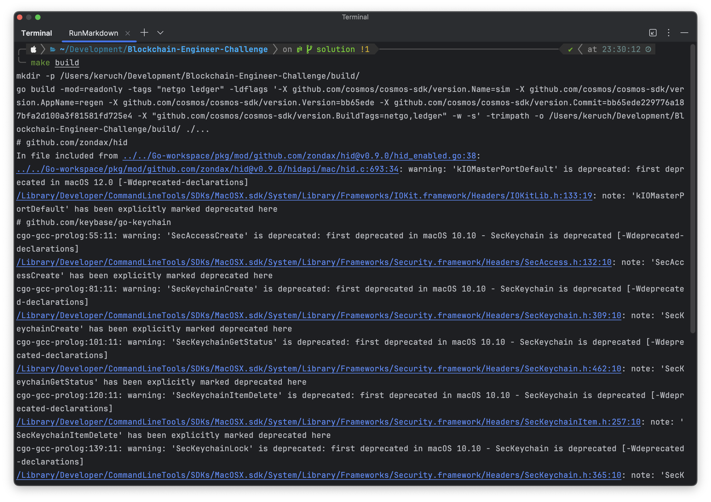
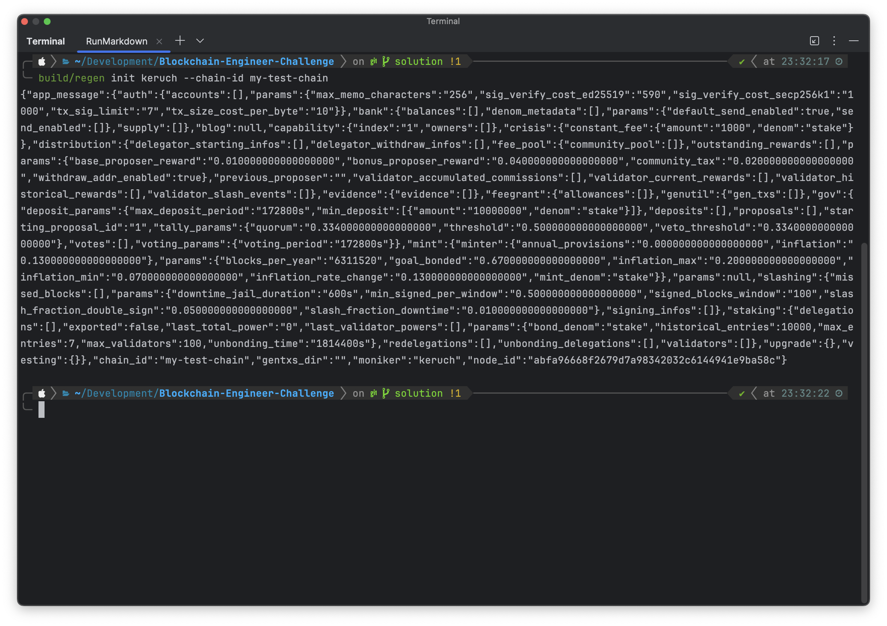
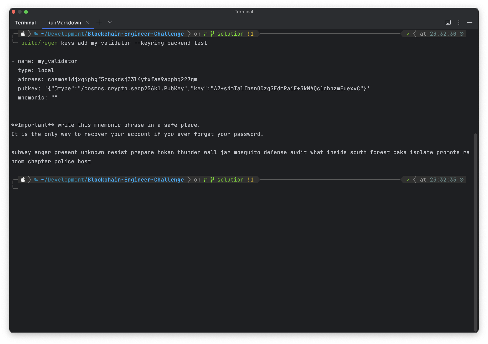
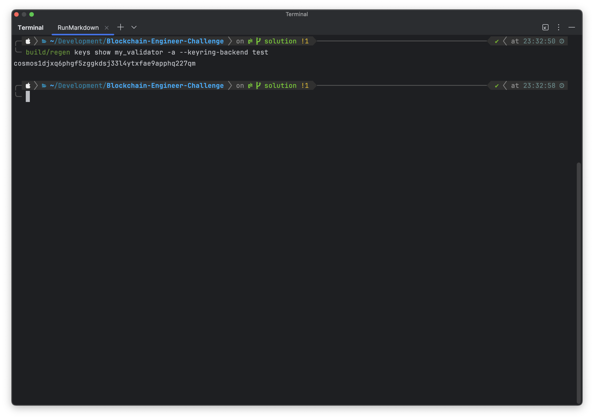
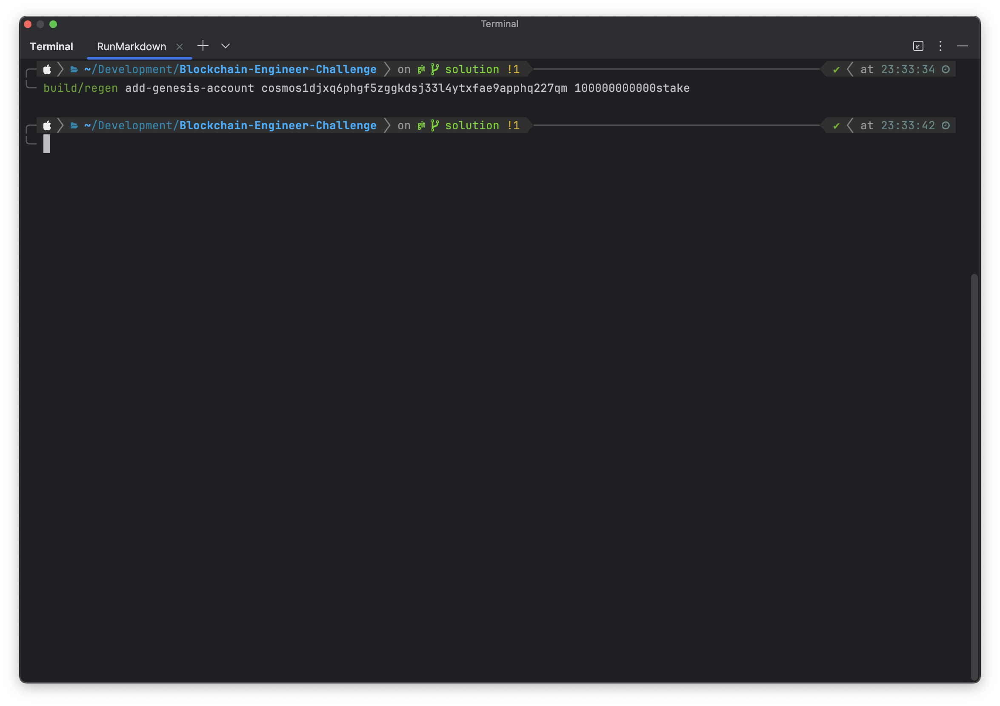
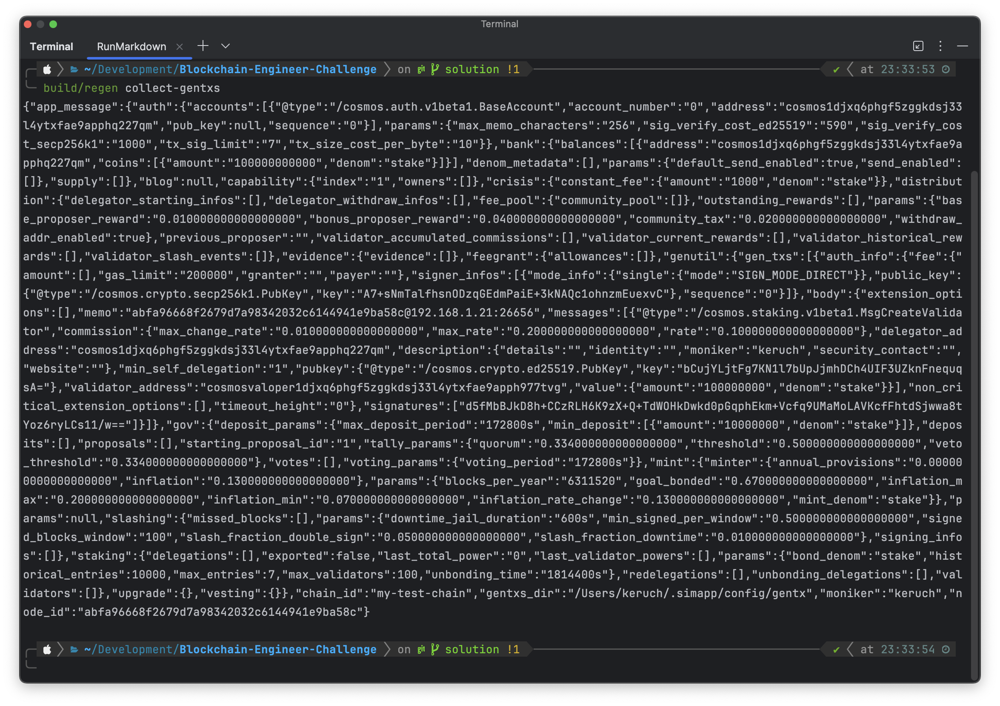
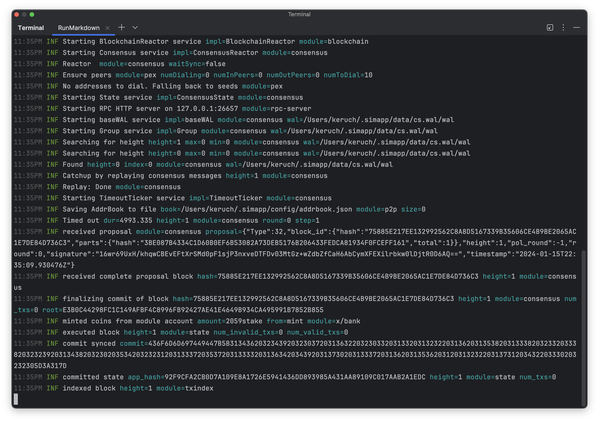
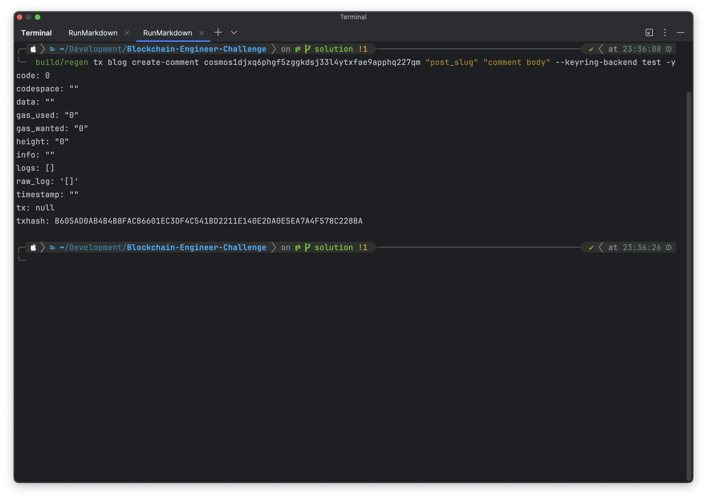
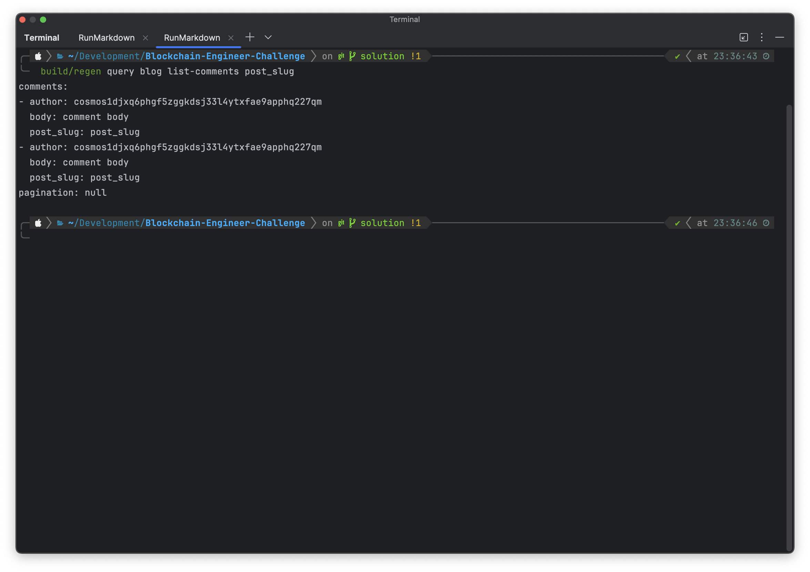

# Solution

This branch contains the given challenge solution.

## Run node

Firstly, we should run our node. Detailed documentation can be found [here](https://docs.cosmos.network/v0.46/run-node/run-node.html).

1. Build a node
    ```bash
    make build
    ```
   

2. Initialize a chain
    ```bash
    build/regen init keruch --chain-id my-test-chain
    ```
   

3. Create a genesis account
    ```bash
    build/regen keys add my_validator --keyring-backend test
    ```
   

4. Get an address to use it in further operations; mine is `cosmos1djxq6phgf5zggkdsj33l4ytxfae9apphq227qm`
    ```bash
    build/regen keys show my_validator -a --keyring-backend test
    ```
   

5. Add tokens to the account
    ```bash
    build/regen add-genesis-account cosmos1djxq6phgf5zggkdsj33l4ytxfae9apphq227qm 100000000000stake
    ```
   
   
6. Create validator
    ```bash
    build/regen gentx my_validator 100000000stake --chain-id my-test-chain --keyring-backend test
   
    build/regen collect-gentxs
    ```
   
   
7. Run a local network
    ```bash
    build/regen start
    ```
   
   
## Perform operations
1. Set chain-id
     ```bash
    build/regen config chain-id my-test-chain
    ```
   
   
2. Create a post
    ```bash
    build/regen tx blog create-post cosmos1djxq6phgf5zggkdsj33l4ytxfae9apphq227qm "post_slug" "title" "post body" --keyring-backend test -y
    ```
   
   
3. Create a comment
   ```bash
    build/regen tx blog create-comment cosmos1djxq6phgf5zggkdsj33l4ytxfae9apphq227qm "post_slug" "comment body" --keyring-backend test -y
    ```
   
   
4. List all available comments for the given post
   ```bash
    build/regen query blog list-comments post_slug
    ```
   I ran the third command twice, so there are two of them
   
